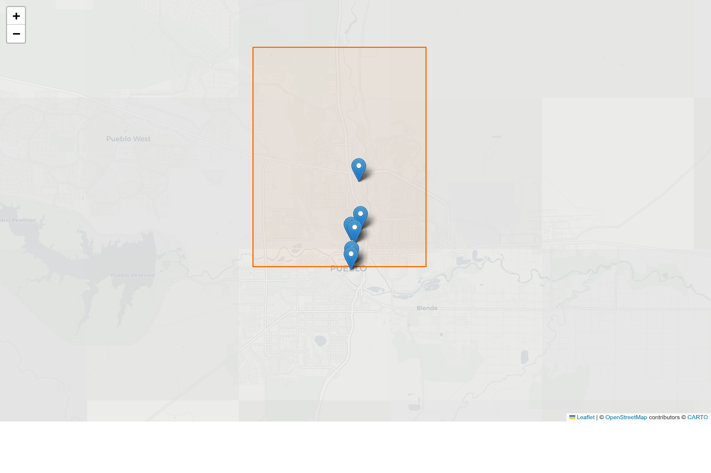

<p align="center" width="100%">
    
</p>

# La Raza VII.I.IX - A Field Guide on Open Source Intelligence (OSINT) and Technology Primers
This project equips community journalists, activists, and engaged citizens with the tools, techniques, and knowledge for effective open-source research and secure technology practices, fostering resilience and informed action. It also serves as a research log for secure communication methodologies, independent analysis of community issues, and the development of accessible tech solutions to empower all.

For all of our family.

---

## Pueblo Surveillance Apparatus Map

<p align="center">
  <a href="docs/maps/pueblo-surveillance-map.html">
    
  </a>
</p>

<p align="center"><em>Click to view interactive map | Shows RTCC, ShotSpotter zones, Flock ALPR corridors, DFR drone station, park surveillance, ICE watch sites, and community support services</em></p>

---

## Latest Updates (January 2026)

**Surveillance Infrastructure Updates:**
- RTCC technology stack fully documented (Genetec ~$200k, ShotSpotter $210k, Flock, DFR drones)
- ShotSpotter coverage split into two polygons: Eastside (~2 sq mi) and Bessemer (~1 sq mi, added July 2025)
- Community Connect 4-pillar program documented with self-advocacy actions
- DFR (Drone as First Responder) station added to GeoJSON (launched July 2025)
- Mobile camera trailer location updated (Mesa & Elm, captured Aug 2025 homicide footage)
- PCSO 73 mobile ALPR inventory confirmed
- Park surveillance metadata expanded (all 5 parks now show ARPA funding, RTCC feed status)

**ICE Infrastructure Documentation:**
- Walsenburg detention center documented (CoreCivic, 752 beds, ACLU FOIA docs)
- Pueblo Airport ICE deportation flight email (Greg Pedroza, Sept 2025)
- Hudson detention center ($39M GEO Group contract, 1,200 beds, Dec 2025)
- Air Without ICE coalition organizing details (NAACP Pueblo, El Movimiento Sigue, Together Colorado)
- Speak Up Southern Colorado (Walsenburg organizing)

**Data Flow Analysis:**
- Full surveillance stack hierarchy documented (Community Connect → RTCC → CO Network → Flock → Palantir)
- Flock "Nova" platform early access warning (404 Media)
- Denver audit log ICE scandal details (1,400+ searches, Loveland/Windsor PD federal agent access)

**Critical Fixes:**
- Fixed inaccurate council member data and reconciled political roster with official City of Pueblo records
- Updated Juniper Southern Colorado (formerly Rape Crisis Services) with new 24/7 crisis line: **719-549-0549**
- Fixed `monitor_agendas.py` to actually scrape county commissioners (was defined but never processed)

**New Spanish Translations:**
- [Derechos de Grabación en Colorado](primers/Derechos%20de%20Grabacion%20en%20Colorado.md) - Recording Rights
- [Derechos de Protesta Primera Enmienda](primers/Derechos%20de%20Protesta%20Primera%20Enmienda.md) - First Amendment Protest Rights

**New Handouts & Guides:**
- [Traffic Stop Rights Card](docs/handouts/Traffic-Stop-Rights-Card.md) - Bilingual wallet-sized card
- [Post-Arrest Roadmap](docs/handouts/Post-Arrest-Roadmap.md) - First 72 hours guide
- [Police Violence Documentation Primer](primers/Police%20Violence%20Documentation.md) - How to document, preserve, and report

**Expanded Data:**
- GeoJSON now includes ShotSpotter Eastside + Bessemer coverage polygons, ALPR corridors, DFR drone station, and institutional POIs
- Resources directory expanded with bail funds, worker rights orgs, LGBTQ+ services, and digital security help
- Surveillance data updated with Flock-ICE scandal details, EFF protest surveillance findings, and racial disparity statistics
- 10 new source citations added to logs/source_index.md

**Stay safe. The times demand it.**

## Table of Contents
- [Pueblo Surveillance Apparatus Map](#pueblo-surveillance-apparatus-map)
- [Purpose](#purpose)
- [Disclaimer](#disclaimer)
- [How to Use This Repo](#how-to-use-this-repo)
- [Repository Structure](#repository-structure)
- [Pueblo 81008 Field Priorities](#pueblo-81008-field-priorities)
- [Data & Map Outputs](#data--map-outputs)
- [Roadmap: Guides & Self-Advocacy](#roadmap-guides--self-advocacy)
- [Field Use: Protest & Outreach Protection](#field-use-protest--outreach-protection)
- [Operational Security Layers](#operational-security-layers)

---

## Purpose
In today’s digital landscape, privacy and operational security (OPSEC) are more important than ever. This guide will walk you through practical steps to secure your devices, communications, and data, ensuring that your online presence remains as private as possible. This is a field guide covering as much ground as we can, and attempting to distill it to the level anyone can use.

## Disclaimer
This project is worked on over time and space; while workflow guides may be shared, the world continues to evolve at light speed. Some information may be outdated by the time you see it, some techniques may be compromised by the time you use them, and some information may just be completely wrong. The goal here is to plant seeds for trees to grow from; learn, trust, but verify.

## How to Use This Guide

This guide works **completely offline** once downloaded—no internet required. Choose the method that fits your comfort level:

---

### Option A: Read Online (Easiest)

Just browse this page. Click any link to read that section. No download needed.

**Limitations:** Requires internet, can't make personal notes, leaves browsing history.

---

### Option B: Download to Computer (Offline Use)

**What you'll get:** A folder with all guides, maps, and resources that works without internet.

#### Windows

1. Go to [github.com/samedayhurt/laraza](https://github.com/samedayhurt/laraza)
2. Click the green **"Code"** button
3. Click **"Download ZIP"**
4. Find the downloaded file (usually in your Downloads folder), right-click it, select **"Extract All"**
5. Open the extracted `laraza-main` folder
6. Double-click any `.md` file to open it (they open in Notepad or any text editor)

**Tip:** For better reading, install a free Markdown viewer like [Typora](https://typora.io/) or [Mark Text](https://marktext.app/).

#### Mac

1. Go to [github.com/samedayhurt/laraza](https://github.com/samedayhurt/laraza)
2. Click the green **"Code"** button → **"Download ZIP"**
3. The ZIP will auto-extract in your Downloads folder (or double-click it)
4. Open the `laraza-main` folder
5. Double-click any `.md` file to read it in TextEdit

#### Linux

**Option 1 - Download ZIP:** Same as above, extract with your file manager.

**Option 2 - Command line:**
```bash
git clone https://github.com/samedayhurt/laraza.git
cd laraza
```

---

### Option C: Use with Obsidian (Best Experience)

[Obsidian](https://obsidian.md/) is a free note-taking app that makes this guide **interactive**—linked notes, searchable, and you can add your own research.

#### Step 1: Download the Guide

Follow Option B above to download and extract the files.

#### Step 2: Install Obsidian

1. Go to [obsidian.md](https://obsidian.md/)
2. Click **"Get Obsidian for free"**
3. Download for your system (Windows/Mac/Linux)
4. Install it like any other app

#### Step 3: Open as Vault

1. Open Obsidian
2. Click **"Open folder as vault"**
3. Navigate to the `laraza-main` folder you downloaded
4. Click **"Open"**
5. If prompted about "Trust author," click **"Trust"**

#### Step 4: Start Exploring

- Use the **left sidebar** to browse folders
- Click any note to read it
- Use `Ctrl+O` (or `Cmd+O` on Mac) to quickly search for any topic
- Try the **Graph View** (icon in left sidebar) to see how topics connect

**Making it yours:** Add your own notes, research, and observations. Your changes stay local—they won't affect anyone else's copy.

---

### Option D: Use on Phone (Offline)

#### Android

1. Install **Obsidian** from Google Play Store (free)
2. Download the guide:
   - In your phone's browser, go to [github.com/samedayhurt/laraza](https://github.com/samedayhurt/laraza)
   - Tap green **"Code"** button → **"Download ZIP"**
   - Extract the ZIP using your file manager (or install "ZArchiver" from Play Store)
3. Open Obsidian → **"Create new vault"** → **"Open folder as vault"**
4. Navigate to the extracted `laraza-main` folder → **"Use this folder"**

#### iPhone/iPad

1. Install **Obsidian** from App Store (free)
2. Download the guide:
   - In Safari, go to [github.com/samedayhurt/laraza](https://github.com/samedayhurt/laraza)
   - Tap green **"Code"** button → **"Download ZIP"**
   - When download completes, tap it to extract
   - Move the folder to "On My iPhone" in Files app
3. Open Obsidian → **"Open folder as vault"**
4. Navigate to the folder → **"Open"**

---

### Keeping Your Copy Updated

The guide is updated regularly. To get the latest version:

**If you downloaded the ZIP:** Download a fresh copy and replace your old folder (back up any personal notes first).

**If you used `git clone`:**
```bash
cd laraza
git pull
```

---

### Privacy Note

Downloading this guide leaves minimal trace—far less than reading online. For maximum privacy:
- Download over VPN or Tor
- Use the offline copy exclusively
- Store on an encrypted drive

See [Operational Security Layers](primers/Operational-Security-Layers.md) for complete privacy guidance.

---

### Encrypt Your Device (Recommended)

Full disk encryption ensures that if your device is lost, stolen, or seized, the data remains unreadable without your password.

#### Windows

**BitLocker (Windows Pro/Enterprise):**
1. Open **Control Panel** → **System and Security** → **BitLocker Drive Encryption**
2. Click **Turn on BitLocker** for your main drive
3. Choose how to unlock: **Password** recommended
4. Save your recovery key somewhere safe (NOT on the same device)
5. Choose **Encrypt entire drive** → **New encryption mode**
6. Click **Start encrypting**

**VeraCrypt (Windows Home or any version):**
1. Download from [veracrypt.fr](https://www.veracrypt.fr/en/Downloads.html)
2. Install and open VeraCrypt
3. Go to **System** → **Encrypt System Partition/Drive**
4. Choose **Normal** → **Encrypt the Windows system partition**
5. Choose **Single-boot** (unless you dual-boot)
6. Create a strong password and PIM (leave PIM blank for default)
7. Create the rescue disk when prompted (required)
8. Run the pre-test, then encrypt

#### Mac

**FileVault (Built-in):**
1. Open **System Preferences** → **Security & Privacy** → **FileVault**
2. Click the lock icon and enter your password
3. Click **Turn On FileVault**
4. Choose how to unlock: **iCloud account** or **recovery key** (recovery key is more private)
5. Save your recovery key somewhere safe
6. Encryption begins automatically (takes a few hours)

#### Linux

**During Installation (Easiest):**
Most Linux installers offer "Encrypt the new installation" during setup. Check this box and set a strong passphrase.

**After Installation (LUKS):**
Encrypting after install is complex and risky—reinstall with encryption enabled if possible. For existing systems, consider encrypting your home folder:
```bash
# Install ecryptfs
sudo apt install ecryptfs-utils
# Migrate your home directory (log in as different user first)
sudo ecryptfs-migrate-home -u yourusername
```

#### Android

Most modern Android phones are encrypted by default. To verify:
1. Go to **Settings** → **Security** → **Encryption & credentials**
2. Should say "Encrypted" under "Encrypt phone"

If not encrypted:
1. Charge to 80%+ and plug in
2. Go to **Settings** → **Security** → **Encrypt phone**
3. Set a strong PIN/password (pattern is weaker)
4. Wait for encryption to complete (1-2 hours)

**GrapheneOS:** Encrypted by default with stronger implementation than stock Android.

#### iPhone/iPad

iOS devices are encrypted by default when you set a passcode.

**Strengthen it:**
1. Go to **Settings** → **Face ID & Passcode** (or Touch ID & Passcode)
2. Tap **Change Passcode**
3. Tap **Passcode Options** → **Custom Alphanumeric Code**
4. Set a strong password (not just 6 digits)

**Why this matters:** A 6-digit PIN can be cracked in hours. An alphanumeric password with 10+ characters could take years.

---

### Self-Hosting Your Infrastructure

For maximum control over your data, consider self-hosting your own cloud services. This eliminates third-party access to your files, communications, and research.

**See the full guide:** [Self-Hosting Infrastructure](primers/Self-Hosting-Infrastructure.md)

Quick overview of what you can self-host:
- **File sync:** Nextcloud, Syncthing
- **Passwords:** Vaultwarden (Bitwarden compatible)
- **Communication:** Matrix/Element, XMPP, Jitsi
- **VPN:** WireGuard, Tailscale
- **Notes:** Obsidian + Syncthing, Joplin Server

---

## Repository Structure
- **[Primers](primers/README.md):** Fast-start guides for Linux, direction finding, virtual machines, and other fundamentals.
- **[Secure Communication Techniques](comms/README.md):** Living playbooks for digital + RF channels, plus workflows like [Strong & Anonymous File Sync](comms/e2eefilechange.md) and the new [`GrapheneOS Mudi Field Kit`](comms/GrapheneOS%20Mudi%20Field%20Kit.md).
- **[Operational Security](opsec/README.md):** Threat-model worksheets, daily discipline checklists, Pueblo-specific legal observer workflows, and source vetting procedures aimed at civilians rather than military units.
- **[Non-Standard Communications](comms/nscomms.md)** & **[Direction Finding](primers/Direction%20Finding%20(Wi-Fi).md):** Specialized research threads that support Pueblo-focused investigations and counter-surveillance scouting.
- **[Pueblo 81008 Surveillance Memo](opsec/Pueblo%2081008%20Surveillance.md):** Political landscape notes, RTCC inventory, commercial telemetry analysis, police-abuse reporting routes, ICE collaboration research, and “5-minute” action blocks.
- **[Pueblo County Officials](opsec/Pueblo%20County%20Officials.md):** Quick reference on which party controls each county office plus the business ties and high-stakes decisions tied to those officials, paired with the new [`Legal Observer Toolkit`](opsec/Legal%20Observer%20Toolkit.md) for documentation escalations.
- **[Scripts](scripts/):** Automation such as `build_pueblo_map.py` to regenerate the folium overlay without external GIS tools.

## Pueblo 81008 Field Priorities
- **Political control:** Use `opsec/Pueblo County Officials.md` before outreach meetings to surface conflicts of interest (e.g., Republic Shooting Range co-ownership, sheriff lawsuits) and align campaigns with the right office.
- **Surveillance stack:** `opsec/Pueblo 81008 Surveillance.md` consolidates RTCC tooling, Community Connect tactics, ALPR corridors, and now Pueblo-specific police abuse + ICE reporting workflows.
- **Rapid protest comms:** `comms/GrapheneOS Mudi Field Kit.md` adapts DSOK’s GrapheneOS router workflow for medics, scouts, and legal observers who need hardened connectivity in 81008 without touching personal SIMs.
- **Accountability escalations:** The surveillance memo now points directly to Pueblo PD Internal Affairs forms, Colorado POST certification complaints, the Attorney General’s pattern-and-practice form, and Colorado Rapid Response Network (CORRN) hotline instructions so community members can escalate abuse or ICE sightings immediately.

## Data & Map Outputs
- **`data/pueblo_apparatus.geojson`** — working GeoJSON covering the 81008 boundary approximation, RTCC, downtown Flock ALPR zone, and Pueblo Mall security footprint.
- **`docs/maps/pueblo-surveillance-map.html`** — editable folium map (GitHub Pages friendly) driven by the GeoJSON to visualize sensors and political targets along march routes. A static preview (`docs/maps/pueblo-surveillance-map.png`) now lives alongside it for README embeds.
- **[`docs/pueblo-watchlist.md`](docs/pueblo-watchlist.md)** — rolling agenda/procurement tracker so you can match surveillance votes to the officials and business ties documented in `opsec/`.
- **`scripts/build_pueblo_map.py`** — regenerates the HTML overlay whenever the GeoJSON changes so everyone shares the same situational awareness.
- **[`docs/digital-footprint-protection.md`](docs/digital-footprint-protection.md)** — ties the research workflow to device hygiene, metadata minimization, and the comms/OPSEC primers so teams keep their digital footprint tight while executing the roadmap.
- **[`docs/data-legend.md`](docs/data-legend.md)** — summarizes where each dataset/report comes from (census, media, vendor releases, automation scripts) so readers can audit provenance and extend the pipeline transparently.

## Roadmap: Guides & Self-Advocacy
We follow the `AGENTS.md` workflow so research flows into actionable guides that teach Pueblo residents how to advocate for themselves.

1. **Research + Logging Layer**
   - Populate the raw/structured notebooks in `data/` (politics, surveillance/policing, immigration/ICE, community resources) and cite everything inside `logs/source_index.md`.
   - Record investigations, FOIA/CORA pulls, and desk research sessions in `logs/search_log.md` so anyone can audit how findings were produced; log TODOs (e.g., district-level census pulls, upcoming council agendas) in context notes so future sprints can pick them up quickly.
2. **Report & Guide Production**
   - Draft and continuously update the five Markdown reports inside `reports/`, prioritizing sections like “How to assert your right to record,” “How to push back on surveillance purchases,” and “Where to get immediate legal/financial help.”
   - Pair every risk description with a corresponding “self-advocacy move” (filing complaints, rallying allies, requesting hearings, redirecting budgets) before publishing.
3. **Community Activation & Review**
   - Convert report highlights into teach-ins, handouts, or Signal briefs for journalists, activists, organizers, and residents navigating arrests or ICE pressure.
   - Run a `logs/safety_ethics_review.md` check before release to ensure no private residents are exposed and that guidance stays rights-affirming rather than escalatory.

Update this roadmap as needs evolve—each bullet should map to issues/tasks so contributors understand how their work strengthens Pueblo’s self-advocacy muscle.

## Field Use: Protest & Outreach Protection
- **Primers** help field researchers and volunteer medics spin up clean laptops/VMs before deployments so seized gear can’t reveal networks.
- **Secure Communication Techniques + Non-Standard Comms** pair encrypted drops (Tor + gocryptfs) with LoRa/APRS redundancies for marches where cell service or legal protections collapse.
- **GrapheneOS + Mudi kit** (documented under Comms & OPSEC) gives you a travel router + hardened phone chain so you can uplink livestreams or legal updates without exposing your home IP.
- **Operational Security** translates lessons to civilian teams: build threat models per action, enforce compartmentalized personas, and keep source notes in encrypted Obsidian vaults.
- **Pueblo 81008 memo/map** shows where surveillance infrastructure lives (RTCC feeds, Flock cameras) so organizers can plan ingress/egress routes that avoid persistent monitoring.
- **Pueblo County Officials guide** surfaces which electeds own businesses or make policy decisions affecting protest permits, jail funding, or public-records access—fuel for research requests and accountability campaigns.

When in doubt, start with the folder README to understand how each section is meant to be used in the field.

## Operational Security Layers

Security is about layers—no single tool protects you completely, but combining the right tools for your threat level creates meaningful protection. We've organized our security guidance into a progressive system that scales with your needs.

| Layer | Tools | Use Case |
|-------|-------|----------|
| **1. Browser** | Hardened Firefox, uBlock Origin, containers | Daily research, reading agendas, general OSINT |
| **2. Network** | VPN (Mullvad/ProtonVPN), Tor Browser | Anonymized research, sensitive searches |
| **3. Isolation** | Virtual Machines (TraceLabs, Kali, Whonix) | Handling untrusted files, deep research |
| **4. Hardware** | Mudi router + Blue Merle, GrapheneOS | Field deployment, protests, documentation |
| **5. Communications** | Signal, encrypted Obsidian vaults | Coordination, sharing findings securely |

**Start with Layer 1, add layers as your threat model requires.**

For complete setup guides, threat model analysis, and practical workflows (researching city agendas, documenting protests, handling CORA requests), see:

**[Operational Security Layers (Full Guide)](primers/Operational-Security-Layers.md)**

The guide includes:
- Step-by-step setup for each layer
- Tool recommendations with security criteria
- VM configurations for OSINT research
- Mudi router + Blue Merle IMEI randomization
- Signal best practices for group security
- Practical workflows tied to Pueblo-specific threats
