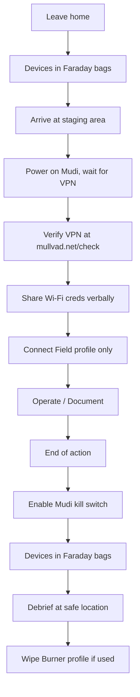

# GrapheneOS + Mudi Civilian Field Kit

A complete guide to building a hardened mobile communications kit for protests, documentation, and field operations. This setup keeps your sensitive activity off personal networks and defeats tower dumps, stingray sweeps, and ad-tech tracking.

**What this kit provides:**
- Hardened phone that doesn't leak data to Google
- Anonymous network access via portable 4G router
- VPN/Tor routing for all traffic
- IMEI/MAC randomization to prevent tracking
- Clean separation from your personal identity

---

## Hardware Requirements

### Phone: Google Pixel

GrapheneOS only supports Pixel devices. Recommended models:

| Model | Status | Notes |
|-------|--------|-------|
| Pixel 8 / 8 Pro / 8a | Best | Latest security, longest support |
| Pixel 7 / 7 Pro / 7a | Excellent | Great balance of price and support |
| Pixel 6 / 6 Pro / 6a | Good | Budget option, still supported |
| Pixel Fold / Tablet | Supported | Specialized use cases |

**Where to buy:**
- Used from Swappa, eBay (check ESN is clean)
- New unlocked from Google Store or Best Buy
- **Important:** Must be carrier-unlocked (not locked to a carrier)

**Budget:** $200-400 used, $500-900 new

### Router: GL.iNet Mudi

The GL-E750 Mudi is a portable 4G LTE router with built-in battery, VPN support, and advanced privacy features.

**Model options:**
- GL-E750 (Mudi) - Original, widely available
- GL-E750V2 (Mudi V2) - Updated version
- GL-XE300 (Puli) - Smaller, cheaper alternative

**Where to buy:** [gl-inet.com](https://www.gl-inet.com/) or Amazon

**Cost:** ~$170-230 (with 4G modem)

### Accessories

| Item | Purpose | Cost |
|------|---------|------|
| USB-C data cable (quality) | Flashing GrapheneOS | $10-15 |
| USB-C PD charger (65W+) | Fast charging | $20-30 |
| Prepaid SIM (cash-bought) | Anonymous data | $20-50 |
| SIM refill cards | Maintaining service | Varies |
| 10,000+ mAh battery bank | Extended operation | $20-40 |
| Faraday bag/sleeve | RF isolation | $15-30 |
| USB-C to Ethernet adapter | Router fallback | $15-20 |

**Total kit cost:** $450-800 depending on phone choice

---

## Part 1: Installing GrapheneOS

### Prerequisites

- Windows, Mac, or Linux computer with Chrome/Chromium browser
- USB-C data cable (charging-only cables won't work)
- Your Pixel phone with at least 50% battery
- 30-60 minutes of uninterrupted time

### Step 1: Prepare the Pixel

1. **Power on** the new/reset Pixel
2. **Skip all setup prompts:**
   - Don't connect to Wi-Fi (tap "Skip" or "Set up offline")
   - Don't sign into Google
   - Don't set up biometrics yet
   - Skip everything until you reach the home screen

3. **Enable Developer Options:**
   - Go to **Settings** → **About phone**
   - Tap **Build number** 7 times rapidly
   - Enter PIN/pattern if prompted
   - You'll see "You are now a developer!"

4. **Enable OEM Unlocking:**
   - Go to **Settings** → **System** → **Developer options**
   - Scroll down, enable **OEM unlocking**
   - Confirm the warning

5. **Enable USB Debugging:**
   - Still in Developer options
   - Enable **USB debugging**
   - Confirm the warning

### Step 2: Flash GrapheneOS

1. **Open the web installer:**
   - Go to [grapheneos.org/install/web](https://grapheneos.org/install/web)
   - Use Chrome, Chromium, or Edge (Firefox doesn't support WebUSB)

2. **Connect your phone:**
   - Plug phone into computer via USB-C
   - On phone, tap **Allow** when asked about USB debugging
   - Check "Always allow from this computer" for convenience

3. **Unlock bootloader:**
   - Click **Unlock bootloader** on the web page
   - Follow prompts to reboot into bootloader mode
   - Use volume keys to select **Unlock the bootloader**, press power to confirm
   - Phone will factory reset (this is normal)

4. **Flash GrapheneOS:**
   - Phone should reconnect to web installer
   - Click **Download release** (this takes a few minutes)
   - Click **Flash release** (takes 5-10 minutes)
   - Don't disconnect the phone during this process

5. **Lock bootloader:**
   - Click **Lock bootloader**
   - Use volume keys to select **Lock the bootloader**, press power
   - This is critical—verified boot won't work without it

6. **Complete:**
   - Phone will reboot into GrapheneOS
   - Disconnect from computer

### Step 3: Initial GrapheneOS Setup

1. **Language and region:** Choose yours

2. **Wi-Fi:** Connect to a trusted network (or skip for now)

3. **Date/time:** Set correctly (important for certificates)

4. **Privacy settings:** GrapheneOS asks about:
   - Network connectivity check (recommend: GrapheneOS server)
   - SUPL (assisted GPS) - can disable for more privacy, slower GPS lock

5. **Create PIN/password:**
   - Use a strong password (not just PIN) for main profile
   - 10+ characters recommended
   - This is your first line of defense if device is seized

6. **Skip everything else:** No Google account, no biometrics yet

---

## Part 2: Setting Up User Profiles

GrapheneOS supports multiple user profiles, each fully isolated from the others. This is crucial for operational security.

### Recommended Profile Structure

| Profile | Purpose | Apps | Network Access |
|---------|---------|------|----------------|
| **Owner** | Administration only | Settings, App stores | Minimal |
| **Home** | Personal use (trusted networks only) | Full apps | Home Wi-Fi only |
| **Field** | Protest/documentation | Signal, Camera, Obsidian | Mudi router only |
| **Burner** | Single-use operations | Minimal | Disposable |

### Creating Profiles

1. Go to **Settings** → **System** → **Multiple users**
2. Enable **Allow multiple users**
3. Tap **Add user** for each profile you need
4. Set up each profile separately (they're fully isolated)

### Profile Tips

- **Owner profile** should have minimal apps—just what's needed to manage the device
- **Don't install sensitive apps in Owner**—if you're forced to unlock, Owner is what they'll see first
- Each profile has its own encryption key derived from its password
- Apps in one profile cannot see data from another
- Switching profiles: swipe down twice, tap the user icon

---

## Part 3: Installing Apps

### App Sources (In Order of Preference)

**1. GrapheneOS App Store (Built-in)**
- Pre-installed, contains GrapheneOS-specific apps
- Includes Vanadium browser, PDF viewer, camera app

**2. F-Droid (Free/Open Source Apps)**
- Install from [f-droid.org](https://f-droid.org/)
- Download the APK, open with Files app, install
- Only contains open source software

**3. Aurora Store (Play Store Alternative)**
- Anonymous access to Google Play apps without Google account
- Install from F-Droid first
- Use "Anonymous" login option

**4. Direct APK Download**
- For apps that provide official APKs (Signal, Mullvad, etc.)
- Always verify downloads from official sources

**5. Sandboxed Google Play (If Necessary)**
- GrapheneOS can run Google Play in a sandbox
- Apps can't access special privileges
- Use only if you need specific apps not available elsewhere

### Installing F-Droid

1. On your phone, open Vanadium browser
2. Go to [f-droid.org](https://f-droid.org/)
3. Download F-Droid APK
4. Open notification, tap the download
5. Tap **Install** (you may need to allow installation from this source)
6. Open F-Droid, let it update repositories

### Installing Aurora Store

1. Open F-Droid
2. Search for "Aurora Store"
3. Install it
4. Open Aurora Store
5. Choose **Anonymous** login (don't use Google account)
6. Now you can install Play Store apps without Google

### Recommended Apps by Profile

**Field Profile (Protest/Documentation):**

| App | Source | Purpose |
|-----|--------|---------|
| Signal | signal.org/android/apk | Secure messaging |
| Element | F-Droid | Matrix client, backup comms |
| Briar | F-Droid | Offline mesh messaging |
| Organic Maps | F-Droid | Offline maps |
| Open Camera | F-Droid | Better camera app |
| Obsidian | obsidian.md | Secure notes |
| Syncthing | F-Droid | File sync |
| Mullvad VPN | F-Droid | VPN client |
| Orbot | F-Droid | Tor proxy |
| Scrambled Exif | F-Droid | Strip photo metadata |

**Home Profile:**
- Add whatever you need for daily use
- Consider separating work and personal further

### Installing Sandboxed Google Play (Optional)

Only do this if you need apps that aren't available through F-Droid or Aurora:

1. Go to **Settings** → **Apps** → **Sandboxed Google Play**
2. Tap **Install Google Play services**
3. Wait for download and installation
4. Open **Play Store**, sign in with a non-primary Google account (or create throwaway)
5. Install needed apps

**Important:** Even sandboxed, Google sees what apps you install. Use Aurora Store for anonymity when possible.

---

## Part 4: Hardening the Mudi Router

### Initial Setup

1. **Insert SIM card** (cash-bought prepaid)

2. **Power on** the Mudi

3. **Connect to Mudi Wi-Fi:**
   - Default SSID: `GL-E750-xxx`
   - Default password: on the device label

4. **Access admin panel:**
   - Open browser, go to `192.168.8.1`
   - Default password: `goodlife`

5. **Change defaults immediately:**
   - New admin password (strong, unique)
   - New Wi-Fi SSID (something generic, not identifying)
   - New Wi-Fi password (share verbally with team)

6. **Update firmware:**
   - Go to **System** → **Upgrade**
   - Check for updates, install if available
   - **Critical for security**

### VPN Configuration

1. **Get VPN configs:**
   - From Mullvad: [mullvad.net/account](https://mullvad.net/account) → WireGuard configuration
   - From ProtonVPN: Download WireGuard configs from account page
   - Generate multiple configs for different servers

2. **Add to Mudi:**
   - Go to **VPN** → **WireGuard Client**
   - Click **Add a New Configuration**
   - Upload or paste your `.conf` file
   - Repeat for backup servers

3. **Enable VPN:**
   - Toggle the VPN on
   - Enable **VPN Kill Switch** (blocks traffic if VPN drops)

4. **Test:**
   - Connect phone to Mudi Wi-Fi
   - Visit [mullvad.net/check](https://mullvad.net/check) or similar
   - Should show VPN IP, not your real IP

### Tor Configuration (Optional Additional Layer)

1. Go to **Applications** → **Tor**
2. Enable Tor client
3. Configure which traffic goes through Tor

**Note:** VPN + Tor is usually redundant. Choose one based on threat model.

### Blue Merle IMEI Randomization

Blue Merle randomizes your router's cellular identifiers, making it harder to track.

1. **SSH into Mudi:**
```bash
ssh root@192.168.8.1
# Password is your admin password
```

2. **Install Blue Merle:**
```bash
cd /tmp
wget https://github.com/srlabs/blue-merle/releases/latest/download/blue-merle.ipk
opkg install blue-merle.ipk
```

3. **Use Blue Merle:**
   - Use the physical toggle switch on Mudi, OR
   - Access via LuCI web interface
   - Randomizes IMEI and MAC on each toggle

**Legal note:** Changing IMEI may be illegal in some jurisdictions. Research local laws.

### Privacy Toggles

In the Mudi admin panel:

1. **MAC Clone/Randomization:**
   - Network → MAC Clone
   - Enable random MAC

2. **Hide SSID:**
   - Wireless → Wireless Security
   - Enable "Hide SSID"
   - Team must know exact SSID to connect

3. **Disable WPS:**
   - Should be off by default
   - Verify in Wireless settings

4. **DNS:**
   - Network → DNS
   - Use privacy-respecting DNS (Mullvad, Quad9, Cloudflare)
   - Or use VPN's DNS (automatic with WireGuard)

---

## Part 5: Field Deployment

### Pre-Deployment Checklist

```
[ ] Mudi battery charged (100%)
[ ] Pixel battery charged (100%)
[ ] Battery bank charged
[ ] VPN configs loaded and tested
[ ] SIM has data balance
[ ] Wi-Fi password written down (for verbal sharing)
[ ] Team roles assigned (media, scouts, legal, comms)
[ ] Signal groups created with disappearing messages
[ ] Faraday bags packed
[ ] Burner profile cleared from last use
```

### Deployment Workflow



### During the Action

**Communications:**
- Use Signal for coordination (disappearing messages ON)
- Briar as backup if cell network is jammed
- Verbal for anything you wouldn't want recorded

**Documentation:**
- Record with Open Camera (no metadata)
- Or use Scrambled Exif to strip metadata after
- Upload to Syncthing/OnionShare immediately when possible
- Don't keep sensitive media on device longer than necessary

**Network Security:**
- Only Field profile connects to Mudi
- Rotate Wi-Fi password if someone leaves the group
- Monitor for unusual devices on the network (Mudi shows connected clients)

**If Approached by Law Enforcement:**
- Lock phone immediately (power button 5x on GrapheneOS)
- You're not required to unlock (5th Amendment in US)
- State: "I don't consent to searches"
- Request lawyer before answering questions
- See [Legal Observer Toolkit](../opsec/Legal%20Observer%20Toolkit.md)

### Post-Action

1. **Enable Mudi kill switch** (stops all traffic)
2. **Put devices in Faraday bags** for transport
3. **At safe location:**
   - Back up important documentation
   - Review footage, note any incidents
   - Update GeoJSON with new surveillance observations
   - Log lessons learned

4. **Clean up:**
   - Wipe Burner profile if used
   - Clear Field profile if highly sensitive
   - Remove SIM and store separately
   - Prepare kit for next deployment

---

## Part 6: Troubleshooting

### GrapheneOS Issues

**Phone won't boot after flashing:**
- Ensure bootloader was locked at the end
- Try reflashing using web installer

**Apps crashing:**
- Some apps require Google Play Services
- Try sandboxed Play Services if needed
- Check if F-Droid version is outdated

**GPS very slow:**
- SUPL was disabled—this is expected
- GPS will work, just takes longer for initial lock
- Consider enabling SUPL with GrapheneOS server

**Battery draining fast:**
- Check which apps have network access
- Disable background activity for unnecessary apps
- Some apps misbehave without Google Services

### Mudi Issues

**No internet on Mudi:**
- Check SIM is properly inserted
- Verify SIM has data balance
- Check APN settings (Mudi usually auto-detects)
- Try different SIM slot if V2

**VPN won't connect:**
- Check config file is correct
- Try different server
- Verify SIM has data (VPN needs internet first)
- Check kill switch isn't blocking the VPN itself

**Can't access admin panel:**
- Make sure you're connected to Mudi Wi-Fi
- Try `192.168.8.1` in browser
- Hard reset if locked out (hold reset 10+ seconds)

**Overheating:**
- Mudi gets warm under load—this is normal
- Remove from case/pocket for ventilation
- Reduce load (fewer devices, disable Tor)

### Field Issues

**Cell network jammed:**
- Switch to Briar (works over Bluetooth/Wi-Fi)
- Mudi can share local Wi-Fi without cell
- Prepare for this scenario in advance

**Device seized:**
- Remain calm, assert rights
- Don't provide passwords
- Notify legal support ASAP
- De-authorize device from Signal on another phone

---

## Quick Reference Card

Print this and keep with your kit:

```
FIELD DEPLOYMENT QUICK START
============================

1. POWER ON MUDI
   - Wait for VPN indicator
   - Check: mullvad.net/check

2. SHARE WI-FI VERBALLY
   - SSID: ________________
   - Pass: ________________
   - Rotate if anyone leaves

3. CONNECT FIELD PROFILE ONLY
   - Never personal profile
   - Verify VPN before sensitive activity

4. IF CONFRONTED
   - Lock phone (power 5x)
   - "I don't consent to searches"
   - "I want a lawyer"
   - Stay silent

5. END OF ACTION
   - Kill switch on Mudi
   - Faraday bags
   - Debrief at safe location

EMERGENCY CONTACTS
==================
Legal support: ______________
CORRN hotline: 844-864-8341
```

---

## References

- [GrapheneOS Web Installer](https://grapheneos.org/install/web)
- [GrapheneOS Usage Guide](https://grapheneos.org/usage)
- [GL.iNet Mudi Documentation](https://docs.gl-inet.com/router/en/4/user_guide/gl-e750/)
- [Blue Merle GitHub](https://github.com/srlabs/blue-merle)
- [Operational Security Layers](../primers/Operational-Security-Layers.md)
- [Legal Observer Toolkit](../opsec/Legal%20Observer%20Toolkit.md)

---

*A hardened device is only as secure as the person using it. Combine technical controls with operational discipline.*
