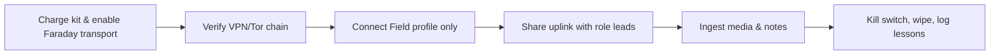

# GrapheneOS + Mudi Civilian Field Kit

This playbook adapts the DSOK GrapheneOS workflows for Pueblo community organizers. It walks you through flashing a hardened phone, pairing it with a GL.iNet Mudi (GL-E750) travel router, and running the combo as a rapid-response shield for marches, outreach tables, or courthouse vigils.

> **Goal:** keep sensitive chatter, media uploads, and legal coordination off home networks while defeating tower dumps, stingray sweeps, and ad-tech tracking in ZIP 81008.

## 1. Hardware Checklist

| Item | Why it matters |
| --- | --- |
| Pixel 6a/7/8 (clean ESN) | Officially supported by GrapheneOS and easy to factory reset after each action. |
| USB-C data cable + 65W USB-C charger | Reliable power + WebUSB flashing without flaky hubs. |
| GL.iNet Mudi (GL-E750 or V2) | All-in-one LTE/Wi-Fi router with battery, WireGuard/Tor clients, kill switch, and MAC randomization support.[^2] |
| Cash-bought SIM + refill cards | Avoids linking deployments to personal billing records. |
| 10,000 mAh battery bank + Faraday sleeve | Keeps the router alive during marches and masks idle beaconing. |

## 2. Flash GrapheneOS the Civilian Way

1. **Prep developer mode safely**
   - Boot the Pixel, skip every account prompt, unlock developer mode (`Settings → About phone → tap Build number 7×`), then enable *OEM unlocking* and *USB debugging* inside `System → Developer options`.
2. **Use the official web installer**[^1]
   - Visit <https://grapheneos.org/install/web> in Chromium, connect the phone directly (avoid hubs), and follow the on-screen steps to reboot into the bootloader, unlock it, and flash the release image.
   - Keep the tab open through the *Lock bootloader* step so verified boot stays intact.
3. **Create purpose-driven profiles**
   - Profile 1 “Home” (never leaves trusted Wi-Fi), Profile 2 “Field” (Signal, Session, Element, Camera), Profile 3 “Burner” (contacts limited to action-specific folks).
   - Disable network permissions for apps unless absolutely necessary; pin a note inside Obsidian reminding you which profile collected which files so you can wipe them precisely.
4. **Load-only vetted APKs**
   - Transfer apk bundles over USB (no Play Store), install from the Files app, and keep hashes in your Obsidian vault for later verification.

## 3. Harden the GL.iNet Mudi

1. **Update firmware + change defaults**
   - Connect via Ethernet, head to `http://192.168.8.1`, upgrade to the latest 4.x firmware, and rotate the admin password + SSID before field use.[^2]
2. **Stack multi-WAN paths**
   - Insert the cash-bought SIM but also preload WireGuard configs (Mullvad, Proton, or self-hosted) plus Tor Client. Test failover between LTE, USB-tethered Graphene, and local Wi-Fi.
3. **Automate privacy toggles**
   - Enable MAC randomization and SSID cloaking, script hourly Wi-Fi password changes, and store them inside the Graphene “Field” profile’s secure notes for quick handoffs.
4. **Prep captive portal bypass**
   - Import a dummy profile with browser headers ready so you can clear hotel/library splash pages without exposing your protest devices.

## 4. Deployment Workflow

| Phase | Action | Outcome |
| --- | --- | --- |
| **Before leaving** | Charge the router + phone, confirm WireGuard handshakes work from a non-home IP, place both inside a Faraday pouch, and write the night’s roles (media, scouts, legal). | Prevents idle pings giving away staging areas. |
| **On-site** | Power the Mudi, wait for VPN+Tor indicators, connect only the Graphene phone first, verify `am.i.mullvad.net` or similar, then share credentials with role leads verbally. | Ensures only vetted devices ever touch the uplink. |
| **Protect the perimeter** | Leave the router in the middle of the march or legal tent, tether additional phones/laptops through Graphene hotspot if carriers jam LTE, and log any weird IMEI requests you see in Signal. | Avoids everyone logging in with personal SIMs that RTCC can subpoena later. |
| **Media intake** | Record footage in the Graphene Field profile, immediately upload via Syncthing/OnionShare over the router, hash the files, and note camera sightings for the Pueblo map. | Keeps sensitive media off confiscatable SD cards. |
| **Tear-down** | Flip the router kill switch, wipe or archive the Graphene Field profile, back up deployment notes inside Obsidian, and store the SIM separately so law enforcement cannot clone it if they seize hardware. | Resets the kit for the next call-out without contaminating safe-house networks. |

## If you only have 5 minutes
1. **Boot Graphene Field profile,** open Signal, and confirm registration lock/vanish timer before you step off.
2. **Power the Mudi** and say the new Wi-Fi password aloud to medics + media; rotate it the moment someone leaves the perimeter.
3. **Snapshot the route** inside Obsidian, flag RTCC cameras you saw, and drop the image in the protest channel so tomorrow’s crew inherits your reconnaissance.

## References
[^1]: “GrapheneOS web installer,” GrapheneOS, accessed Nov 2025. <https://grapheneos.org/install/web>
[^2]: “GL-E750/GL-E750V2 (Mudi/Mudi V2) User Guide,” GL.iNet Docs, accessed Nov 2025. <https://docs.gl-inet.com/router/en/4/user_guide/gl-e750/>

