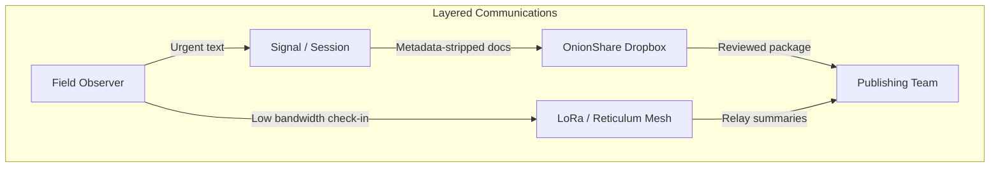

# Secure Communication Techniques

This section covers secure communication practices for operating in monitored environments. The goal: move information only as far as it needs to travel, minimize metadata exposure, and maintain redundant paths that survive platform bans, infrastructure outages, and hostile surveillance.

---

## Quick Start

| If you need to... | Start here |
|-------------------|------------|
| Choose a secure messenger | [Secure Messengers Comparison](Secure-Messengers-Comparison.md) |
| Harden Signal properly | [Signal Hardening Guide](Signal-Hardening-Guide.md) |
| Build a field communications kit | [GrapheneOS + Mudi Field Kit](GrapheneOS%20Mudi%20Field%20Kit.md) |
| Set up radio/mesh communications | [Radio Communications Guide](Radio-Communications-Guide.md) |
| Plan for emergencies | [Emergency Comms Playbook](Emergency-Comms-Playbook.md) |
| Sync files securely | [E2EE File Sync Workflow](e2eefilechange.md) |

---

## Directory Contents

| Resource | Type | Focus |
|----------|------|-------|
| [Signal-Hardening-Guide.md](Signal-Hardening-Guide.md) | Guide | Complete Signal setup, settings, and operational security |
| [Secure-Messengers-Comparison.md](Secure-Messengers-Comparison.md) | Reference | Compare Signal, Session, Element, SimpleX, Briar, Wire, Threema |
| [GrapheneOS Mudi Field Kit.md](GrapheneOS%20Mudi%20Field%20Kit.md) | Playbook | Hardened phone + router for field deployment |
| [Radio-Communications-Guide.md](Radio-Communications-Guide.md) | Guide | Meshtastic, Reticulum, and APRS radio networks |
| [Emergency-Comms-Playbook.md](Emergency-Comms-Playbook.md) | Playbook | Failover procedures, code words, device seizure response |
| [e2eefilechange.md](e2eefilechange.md) | Playbook | End-to-end encrypted file sync workflow |
| [e2eesetup.sh](e2eesetup.sh) | Script | Helper script for E2EE sync setup |
| [nscomms.md](nscomms.md) | Notes | Legacy notes on non-standard communications |
| [assets/](assets/) | Folder | Visual aids (Tor diagrams, etc.) |

---

## Communication Tiers

Establish multiple channels before you need them. If one fails, fall back to the next.

```
TIER 1: Internet-dependent
├── Signal (primary for most people)
├── Element/Matrix (large groups, self-hosted)
└── Session/SimpleX (anonymous, no phone number)

TIER 2: Cell-dependent, no internet
├── SMS (unencrypted, last resort)
└── Voice calls

TIER 3: Mesh/Local (no internet or cell)
├── Briar (Bluetooth/Wi-Fi mesh)
├── Meshtastic (LoRa radio)
└── Reticulum + NomadNet (data over LoRa)

TIER 4: Voice Radio
├── FRS/GMRS (license-free, short range)
└── Ham radio APRS (licensed, longer range)

TIER 5: Physical
├── Runners with written messages
├── Pre-arranged meeting points
└── Dead drops
```

**Always know which tier you're operating on and what fails over to next.**

---

## Core Principles

1. **Define intent first.** Is this channel for coordination, file drops, or public release? Each has unique risk tolerances.

2. **Segmentation.** Separate sensitive chat, working files, and archival storage across different services or devices.

3. **Layered trust.** Pair human verification (code words, voice calls) with cryptographic assurance (fingerprint verification, signed messages).

4. **Metadata minimization.** Disable read receipts, typing indicators, and cloud backups. Strip sender info before forwarding. During Pueblo events, assume RTCC analysts are correlating tower dumps with camera footage—treat metadata as evidence.

5. **Plan degradation.** Every secure channel needs a fallback path (Signal → Briar → physical drop) before you go live.

---

## Guides by Topic

### Secure Messaging

| Guide | What You'll Learn |
|-------|-------------------|
| [Secure Messengers Comparison](Secure-Messengers-Comparison.md) | Which messenger for which threat model, detailed pros/cons |
| [Signal Hardening Guide](Signal-Hardening-Guide.md) | Every Signal setting explained, group security, device seizure |

**Quick recommendations:**
- **Most people:** Signal (easy, encrypted, widely used)
- **Need anonymity:** Session or SimpleX (no phone number)
- **Large groups:** Element/Matrix (self-hostable, federated)
- **Field operations:** Briar (works without internet)

### Mobile Device Security

| Guide | What You'll Learn |
|-------|-------------------|
| [GrapheneOS + Mudi Field Kit](GrapheneOS%20Mudi%20Field%20Kit.md) | Complete field kit: hardened phone + travel router |

**The field kit covers:**
- Installing GrapheneOS on a Pixel
- Setting up isolated user profiles
- Configuring the Mudi router with VPN
- IMEI randomization with Blue Merle
- Field deployment and teardown procedures

### Radio & Mesh Networks

| Guide | What You'll Learn |
|-------|-------------------|
| [Radio Communications Guide](Radio-Communications-Guide.md) | Meshtastic, Reticulum, and APRS from scratch |

**When to use radio:**
- Cell networks jammed or congested
- No internet access
- Need off-grid communication
- Want no central server logging

### Emergency Procedures

| Guide | What You'll Learn |
|-------|-------------------|
| [Emergency Comms Playbook](Emergency-Comms-Playbook.md) | Code words, check-ins, device seizure, team accountability |

**Print the playbook.** When your phone is seized, you can't look this up.

### File Transfer

| Guide | What You'll Learn |
|-------|-------------------|
| [E2EE File Sync Workflow](e2eefilechange.md) | Encrypted sync with gocryptfs + Syncthing/Tor |

---

## Pueblo-Specific Examples

### March Logistics
During a Civic Center rally:
- **Leadership:** Signal for real-time coordination
- **Mass check-ins:** Meshtastic/Reticulum mesh
- **Scouts:** APRS for position reports

If RTCC pulls cellular CDRs, the mesh still carries the meetup points.

### Door Knocking
Outreach crews in 81008:
- Harden Firefox with the [browser primer](../primers/Operational-Security-Layers.md)
- Collect stories in encrypted Syncthing folders
- Upload via Mudi + VPN from the library without burning home IP

### Rapid Legal Response
When arrests happen near Union Ave:
- Sync field notes through Tor
- Alert legal observers over Session (jail phone records can't map the network)
- Use the [Emergency Comms Playbook](Emergency-Comms-Playbook.md) seizure protocol

---

## 5-Minute Field Checklist

When time is short:

1. **Signal blast:** Send one-line update to leadership group, set disappearing timer to 1 hour

2. **Mudi check:** Power on router, confirm VPN handshake at `mullvad.net/check`, share password verbally

3. **Mesh ping:** Broadcast "Safe? Reply 1/0" via Meshtastic so scouts can respond even if carriers throttle

4. **Lock devices:** Verify all phones are set to auto-lock <30 seconds with strong passwords

5. **Verify backup:** Confirm everyone knows the fallback meeting point and time

---

## Communication Flow Diagram



---

## Related Resources

- [Operational Security Layers](../primers/Operational-Security-Layers.md) — Build discipline around these tools
- [Self-Hosting Infrastructure](../primers/Self-Hosting-Infrastructure.md) — Run your own Matrix, Syncthing, etc.
- [Digital Footprint Protection](../docs/digital-footprint-protection.md) — Device hygiene and metadata practices
- [Legal Observer Toolkit](../opsec/Legal%20Observer%20Toolkit.md) — Know your rights

---

*The most secure communication is the one that never happens. Only share what's necessary, only with who needs it, and always have a fallback plan.*
