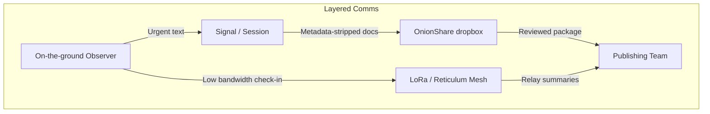

# Secure Communication Techniques
This section is meant to cover ongoing ideas/workflows that enable communication in restricted or monitored environments with the goal of enabling collaboration within a ubiquitous technical surveillance.

## Directory Contents
| Resource | Type | Focus |
| --- | --- | --- |
| [README.md](README.md) | Guide | Conceptual overview plus deep dives on layered comms practices. |
| [e2eefilechange.md](e2eefilechange.md) | Playbook | End-to-end encrypted file sync workflow that keeps metadata minimized. |
| [GrapheneOS Mudi Field Kit.md](GrapheneOS%20Mudi%20Field%20Kit.md) | Playbook | Field-ready checklist for pairing a hardened Pixel with a GL.iNet Mudi router. |
| [nscomms.md](nscomms.md) | Notes | Non-standard communications (LoRa, Reticulum, APRS) firmware tips and workflows. |
| [e2eesetup.sh](e2eesetup.sh) | Script | Helper script that automates parts of the E2EE sync setup described above. |
| [assets/](assets/) | Folder | Visual aids (e.g., Tor hop diagrams) referenced throughout the comms primers. |

## Table of Contents
1. Basic Communication Principles
2. Digital Communications
	1. Encoding
	2. Encrypting
	3. Steganography
	4. Secure Messaging Applications
3. Rapid Deployment Kit: GrapheneOS + Mudi
4. Radio Communications
		1. Basic RF Theory
			1. APRS
		2. IoT Communications
			1. LoRa - Meshtastic
			2. LoRa - Reticulum
5. Primers 

---

## Introduction

The goal is to move information only as far as it needs to travel, expose as little metadata as possible, and leave behind a predictable trail for your own audit logging. Use this folder to design redundant communication paths that survive platform bans, infrastructure outages, and hostile surveillance.

See also the [Digital Footprint Protection Playbook](../docs/digital-footprint-protection.md) for device hygiene and metadata practices that tie directly into these comms workflows.

### Pueblo protest & outreach examples
- **March logistics:** During a Civic Center rally, run Signal for leadership chat, LoRa/Reticulum for mass check-ins, and APRS for bike scouts; if the RTCC pulls cellular CDRs, the Mesh still carries the meetup points.
- **Door knocking:** Outreach crews in 81008 can harden Firefox with the primer, collect stories in encrypted Syncthing folders, and upload via Mudi + VPN from the nearest library without burning home IP space.
- **Rapid legal response:** When arrests happen near Union Ave, use the “5-minute” checklist below—sync field notes through Tor, drop Keybase proofs into the OPSEC vault, and alert legal observers over Session so jail phone records can’t map the network.

## 1. Basic Communication Principles
1. **Define intent first.** Decide whether the channel is for coordination, file drops, or public release—each has unique risk tolerances.
2. **Segmentation.** Separate sensitive chat, working files, and archival storage across different services or devices.
3. **Layered trust.** Pair human verification (code words, voice calls) with cryptographic assurance (fingerprint verification, signed messages).
4. **Metadata minimization.** Disable read receipts, typing indicators, and cloud backups; strip sender info before forwarding. During Pueblo protests assume RTCC analysts are correlating tower dumps with camera footage—treat metadata as evidence.
5. **Plan degradation.** Every secure channel needs a fallback path (e.g., Signal → OnionShare → physical drop) before you go live.

Capture these decisions in your OPSEC notes so teams do not improvise under stress.

## 2. Digital Communications
### 2.1 Encoding
- Use open formats (Base64, ASCII armor) when you need to make binary payloads travel through text fields.
- Keep decoder instructions alongside the drop; assume recipients are on unknown platforms.
- Remember encoding is **not** encryption—encode + encrypt before sharing outside trusted devices.

### 2.2 Encrypting
- **Files:** Follow the [Strong & Anonymous File Sync workflow](e2eefilechange.md) to combine gocryptfs with Tor-hidden Syncthing or Magic Wormhole.
- **Messages:** Prefer forward-secret messengers (Signal, Element over Matrix with verified SAS).
- **Keys:** Store fingerprints inside Obsidian; verify verbally or with in-person QR scans.

### 2.3 Steganography
- Hide short payloads inside photos/audio to bypass keyword filters in monitored spaces.
- Tools: `steghide`, `zsteg`, or custom scripts; always encrypt raw content before embedding.
- Keep cover media consistent with your persona’s usual posts to avoid anomalies.

### 2.4 Secure Messaging Applications
- **Signal:** Enable registration lock, disappearing messages, and safety number verification for every contact.
- **Session / Briar:** Tor/LoRa-friendly options when cellular infrastructure is unreliable.
- **XMPP + OMEMO:** Good for federated communities; host your own server to avoid third-party logging.
- Document account creation dates, device fingerprints, and recovery phrases offline.

## 3. Rapid Deployment Kit: GrapheneOS + Mudi Router
Pair a hardened phone with a travel router so you can deploy comms anywhere in Pueblo in under ten minutes. The full civilian checklist lives in [`GrapheneOS Mudi Field Kit`](GrapheneOS%20Mudi%20Field%20Kit.md); use it when you need step-by-step flashing, SIM rotation, or Faraday transport notes.

1. **Prep the phone**
   - Flash GrapheneOS onto a Pixel following the vetted workflow in the field kit and enroll multiple user profiles (personal, field media, burners).
   - Install only vetted apps (Signal, Session, Element, Briar) from the Graphene app store; disable Google Play completely.
   - Store an offline copy of the Pueblo contacts/PGP keys in the secure profile.
2. **Prep the GL.iNet Mudi (E750)**
   - Load WireGuard + Tor packages, add a no-logs Mullvad account, and pre-configure a Pueblo-friendly exit node.
   - Insert an eSIM or physical SIM purchased with cash; set failover to tether from the Graphene phone if cell service dies.
   - Enable the hardware kill switch for Wi-Fi when traveling so the SSID only broadcasts onsite.
3. **On-site workflow**
   - Drop the Mudi inside a Faraday sleeve until you’re ready; once staged, power it with a battery bank and connect the Graphene phone via USB-C tether or Wi-Fi 6.
   - Run the phone in “Field” profile, connect to the Mudi SSID, and verify the VPN/Tor circuit (`https://am.i.mullvad.net/`).
   - Share the Mudi credentials only with role leads (media, medic, legal). Everyone else uses LoRa/APRS or offline dropboxes.
4. **Tear down**
   - Flip the Mudi kill switch, wipe the Graphene user profile, and log the deployment in Obsidian once you’re back on trusted infrastructure.

This kit keeps your protest perimeter traffic off local ISP logs, thwarts stingray sweeps (since only the router talks to the tower), and provides a clean uplink for livestreams or encrypted drops even when downtown networks are saturated. Run the “If you only have 5 minutes” block in the field kit doc before every march so medics and media inherit the same routine.

## 4. Radio Communications
### 3.1 Basic RF Theory
- Understand frequency, modulation, and propagation so you can select the right band and antenna for the mission.
- Maintain a spectrum map of your operating area; note which channels are busy or legally restricted.

#### APRS
- Automatic Packet Reporting System pushes short position/status bursts via amateur radio.
- Combine a handheld (Baofeng UV-5R) with a TNC or software modem (Dire Wolf) on a Raspberry Pi.
- Obey licensing rules; rehearse message templates so transmissions stay brief.

### 3.2 IoT / Low-Power Networks
#### LoRa - Meshtastic
- Long-range, low-bandwidth messaging for group check-ins or waypoint sharing.
- Flash Meshtastic firmware onto supported boards, configure channels/keys offline, then hand out devices pre-synced.

#### LoRa - Reticulum
- See [Non-Standard Communications](nscomms.md) for deeper setup notes.
- Use Reticulum to build mesh relays that forward packets anonymously and store them until peers reconnect.
- Pair with solar + battery packs for unattended relays.

## 5. Primers and Further Reading
- [Non-Standard Communications](nscomms.md) — LoRa, Reticulum, APRS, and dead drops.
- [Strong & Anonymous File Sync](e2eefilechange.md) — Complete workflow + automation script.
- [Operational Security Techniques](../opsec/Operational%20Security%20Techniques.md) — Build the discipline around these tools.

Add new subfolders as you develop workflows (e.g., HF data bursts, steganography playbooks, community mesh deployments). The more we document now, the faster future operations can spin up resilient communications.

### If you only have 5 minutes
1. **Signal blast:** Send a one-line update (“Ending march, regroup at Mineral Palace”) to the legal + medic group, set the timer to 1 hour, and archive the chat.
2. **Mudi check:** Power on the router, confirm the VPN handshake, and share the password verbally so media can upload while walking to vehicles.
3. **Mesh ping:** Tap “Broadcast” in Meshtastic/Reticulum to send “Safe? Reply 1/0” so scouts can respond even if carriers throttle data.

*Always know which layer you are using and what fails over to next.*
