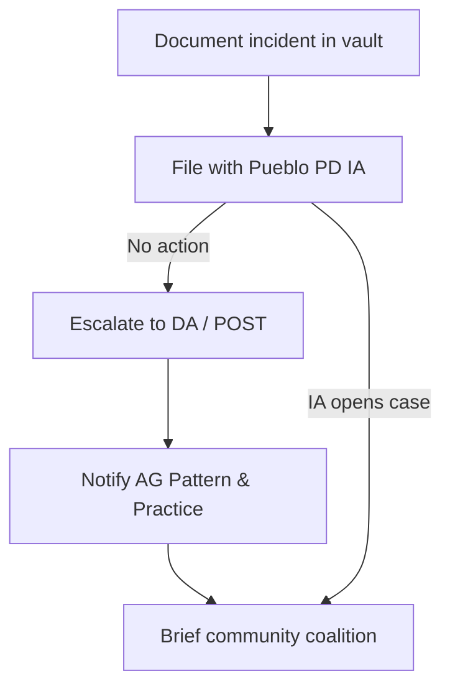
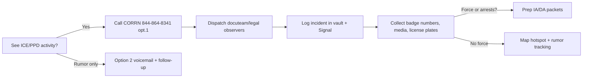

# Pueblo, CO 81008 — Political & Surveillance Apparatus

This memo consolidates open-source reporting on Pueblo’s north-side (81008) civic environment so organizers can anticipate who controls local levers of power and what surveillance tooling is already online.

**Use it tactically:** before you stage an outreach event, scan the map to avoid camera clusters; before you file CORA requests or confront commissioners, consult the “Questions” and “Officials” docs to see who profits from each program.

## 1. Political Power Snapshot
- Historical context: Pueblo has “traditionally been a Democratic stronghold” with mayor-council governance and nine council districts, but remains administratively nonpartisan on paper.[^1]
- 2025 sentiment: Colorado Politics notes Republicans now hold **two of three county commission seats and five of seven city council seats**, an unheard-of shift locally even though council races are nominally nonpartisan.[^2]
- Implication for outreach: narratives about “blue-collar Democratic Pueblo” are out-of-date. Expect GOP-aligned messaging inside municipal meetings even while countywide voter registration still leans Democratic in presidential cycles.

## 2. Police Technology Stack (RTCC)
- **Launch & mission:** The Real-Time Crime Center (RTCC) went live July 2024 to feed frontline officers “critical information that helps improve response times, locate suspects, and assist individuals in need of emergency aid.”[^3]
- **Sensors already online:** According to Daktronics’ September 25, 2025 release, Pueblo’s RTCC integrates ShotSpotter gunshot telemetry, body-worn camera feeds, drone footage when deployed, fixed-site surveillance cameras, and license plate readers.[^3]
- **Visualization hardware:** High Point Networks built a secure network for a 7’ x 12’ Daktronics 1.2 mm dvLED wall so technicians can tile multiple live sources simultaneously.[^3]
- **Operational example:** During a Community Connect open house, Deputy Chief James Martin said the RTCC “observed a hand-to-hand drug transaction through the Daktronics screen,” letting staff identify the suspect, contraband, and accomplices in real time.[^3]
- **ShotSpotter reliance:** The RTCC “relies on ShotSpotter technology with sensors in high-crime areas to send alerts … within 60 seconds of a gunshot,” meaning acoustic telemetry from a private vendor is central to dispatch logic.[^3]

## 3. Community Connect Camera Registry
- **Program framing:** The city pitches Community Connect as voluntary partnerships where residents and businesses can register or stream their cameras to the RTCC, emphasizing faster arrests and neighborhood safety.[^4]
- **Genetec ecosystem:** All four “pillars” revolve around Genetec’s Security Center — on-prem, cloud, and non-Genetec IP feeds — and the site lists preferred Genetec integrators (Arden, High Point, Linx) for locals who want hardware installed.[^4]
- **Data governance gaps:** No retention schedules or warrant requirements are described publicly; registration simply grants detectives lookup access to private footage. Treat this as a soft pressure campaign to normalize police access to HOA/business cameras without judicial oversight.

## 4. Automated License Plate Readers (ALPRs)
- **Downtown deployment:** In 2024 the Pueblo Downtown Association purchased two Flock Safety ALPR cameras, coordinating placement with the city and CDOT to cover major intersections amid auto-theft spikes.[^5]
- **Capabilities:** Flock devices capture still images of every plate, query state and national hotlists, and alert police on stolen vehicles, Amber Alerts, hit-and-run suspects, and even insurance or license-suspension flags referenced in other jurisdictions.[^5]
- **Data handling:** Flock logs every police search, keeps footage encrypted in the vendor cloud, and auto-deletes it after 30 days. The company says captured data remains the property of whoever buys the camera, though law enforcement customers (roughly 30 agencies in Colorado) can pool results through the platform.[^5]
- **Civil-liberties friction:** Local Libertarian officials publicly questioned forcing taxpayers to fund citywide scanning of people “that haven’t done anything wrong,” foreshadowing potential coalition partners for transparency fights.[^5]

## 5. Commercial Telemetry & Data Broker Touchpoints
- **ShotSpotter / SoundThinking:** Gunshot detection sensors are placed in “high-crime” blocks; they are third-party devices whose alerts feed RTCC workflows, meaning false positives or subpoenas hit a private vendor first.[^3]
- **Genetec Cloud Video:** Community Connect pushes households toward Genetec’s SaaS recorder or hybrid cloud, exporting raw footage to data centers outside local control.[^4]
- **Flock Safety:** Vehicle telemetry (time, GPS, plate) lives on Flock’s servers for 30 days, and audit logs show which officer queried which term — useful for accountability but also proof the city is outsourcing investigative memory to a commercial partner.[^5]
- **Body-worn, drone, and city infrastructure video:** All are routed through the RTCC wall, creating a single nerve center whose uptime depends on High Point Networks’ managed infrastructure.[^3]

## 6. Questions for Further OSINT / Accountability
1. **Procurement transparency:** What contracts govern the RTCC (ShotSpotter SLA, Genetec licensing, Flock MOUs)? File CORA requests for scopes + pricing.
2. **Zoning for sensors:** Map where Community Connect registrants exist versus neighborhoods lacking resources; look for inequities north of Hwy 50 (81008).
3. **Data-sharing:** Does PPD feed RTCC footage to regional fusion centers or the Colorado Information Analysis Center (CIAC)?
4. **Governance:** City council (with a GOP majority per Colorado Politics) approves surveillance outlays — track agendas/ordinances for expansion votes.
5. **Commercial telemetry stacking:** Investigate whether insurers’ telematics, utility smart meters, or sidewalk kiosks are also feeding PD intelligence, beyond the disclosed vendors.

## 7. Map + Data Artifacts
- `data/pueblo_apparatus.geojson` — working GeoJSON of ZIP 81008 boundary approximation, RTCC, downtown Flock zone, and Pueblo Mall security footprint.
- `docs/maps/pueblo-surveillance-map.html` — folium overlay you can open in a browser (GitHub Pages friendly) to visualize the above layers.

## 8. Police Brutality & Abuse Reporting Workflow
- **Internal Affairs intake:** Pueblo PD’s Internal Affairs Section accepts complaints in person, via the Citizen’s Written Complaint Form, by phone, or online; every excessive-force, civil-rights, or officer-involved shooting allegation is supposed to be investigated by an IA sergeant.[^6] Bring badges, time stamps, and any video you can safely store in Obsidian or an encrypted container before submitting.
- **Escalate criminal conduct:** If IA stonewalls, the Colorado POST Board says to elevate criminal complaints to the officer’s supervisor, then to the 10th Judicial District Attorney; POST itself can only revoke certifications for disqualifying incidents.[^7]
- **Pattern-and-practice:** For non-criminal misconduct (retaliatory arrests, harassment, etc.), POST’s guidance points to the Attorney General’s Pattern and Practice intake form (select “Governmental Authority”) so the Civil Rights Division can review systemic issues.[^7]
- **Document witnesses:** Pair every complaint with signed statements from legal observers plus hashes of the original media so, if PD releases altered footage, you can prove tampering.

## 9. ICE Presence, Federal Tactics & Community Hotlines
- **Rumors vs. reality:** January 2025 rumors about ICE “roundups” in Pueblo were traced to agents assisting local police with a narcotics arrest, but advocates reported statewide fear and agents knocking on doors, so treat every viral sighting seriously until vetted.[^8]
- **Sheriff boundaries:** Sheriff David Lucero’s Jan. 23, 2025 statement pledges the department “WILL NOT support or participate in any round-up operations,” only helping ICE when criminal charges exist or officer safety demands it; cite the statement when deputies overreach at schools, churches, or clinics.[^9]
- **CORRN hotline:** The Colorado Rapid Response Network dispatches trained legal observers statewide; call **844-864-8341 (option 1)** to report active ICE activity, or option 2 to document a past incident so organizers can map police/ICE collaboration and mobilize docuteams.[^10]
- **Coordinate with legal + data teams:** Plug confirmed incidents into the Obsidian vault and the GeoJSON so march marshals know where joint ICE/PPD actions happened, then prep CORA requests for bodycam footage or jail logs from those nights.

### If you only have 5 minutes
1. **Plan your route:** Open the folium map, screenshot the corridor you’ll march through, and mark any RTCC-connected cameras so scouts can brief the crowd.
2. **Share intel:** Copy-paste the relevant bullet (Flock ALPR storage limits, CORRN hotline, sheriff statement) into the protest Signal channel to remind drivers to cover plates and document ICE interactions.
3. **Task a teammate:** Pick one open question from Section 6 (“Procurement transparency,” etc.) or Section 8 (“IA follow-up”) and assign it before the meeting so someone is always pushing the county for answers.

## References
[^1]: “Pueblo, CO Politics & Voting,” BestPlaces.net, accessed Jan 2025. https://www.bestplaces.net/voting/city/colorado/pueblo
[^2]: Dennis Maes, “Pueblo Democrats are now in disarray,” *Colorado Politics*, Mar 28 2025. https://www.coloradopolitics.com/2025/03/28/pueblo-democrats-are-now-in-disarray-maes-2ed3efb3-f7ee-474e-8597-316bf4c2d007/
[^3]: “Eye On Crime Increases with Daktronics, High Point Networks Collaboration for Pueblo Police Department’s Real-Time Crime Center,” Daktronics press release, Sept 25 2025. https://www.daktronics.com/news/eye-on-crime-increases-with-daktronics-high-point-networks-collaboration-for-pueblo-police-department-s-real-time-crime-center
[^4]: “City of Pueblo Community Connect Program,” City of Pueblo website, accessed Jan 2025. https://www.pueblo.us/2998/City-of-Pueblo-Community-Connect-Program
[^5]: Patrick Nelson, “License plate reading cameras coming to Pueblo,” KOAA News5, 2024. https://www.koaa.com/news/covering-colorado/license-plate-cameras-coming-to-pueblo
[^6]: “Internal Affairs Section,” Pueblo Police Department, accessed Nov 15 2025. https://www.pueblo.us/449/Internal-Affairs-Section
[^7]: “Certification Inquiries & Officer Complaints,” Colorado POST, accessed Nov 15 2025. https://post.colorado.gov/certification-inquiries-officer-complaints
[^8]: Caitlyn Kim, “Rumors of immigration arrests spread across Colorado, but details are unclear,” *Colorado Public Radio*, Jan 24 2025. https://www.cpr.org/2025/01/24/addresssing-colorado-ice-immigration-arrests-rumors/
[^9]: “Sheriff Lucero Issues Statement on Agency’s Cooperation with ICE,” Pueblo County Sheriff’s Office news release, Jan 23 2025. https://www.pueblosheriff.com/DocumentCenter/View/3323/Sheriff-Lucero-Statement
[^10]: “Home | CORRN,” Colorado Rapid Response Network, accessed Nov 15 2025. https://www.coloradorapidresponsenetwork.com/
