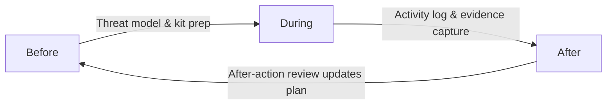

# Operational Security Overview

The `opsec/` directory collects practical playbooks for keeping people, devices, and research safe before, during, and after an investigation. Use it as a quick-reference companion to the deeper dives elsewhere in the repo.

Every section should answer a Pueblo-specific question: *How do we protect canvassers in 81008 when RTCC cameras follow them? How do we ingest footage from a protest without burning our home network?* Keep those scenarios in mind as you adapt the workflows below.

## Start with a Threat Picture
1. **Define the mission:** What story are you pursuing? Who benefits if you fail?
2. **List adversaries:** Local agencies, hired investigators, organized crime, online mobs.
3. **Map their capabilities:** Do they control telecoms? Have malware budgets? Run HUMINT networks?
4. **Set safeguards:** Pair every identified capability with at least one control (encryption, burner devices, compartmentalized meetings, etc.).

Document this in your vault so the entire team works from the same assumptions.

## Folder Guide
| File | Purpose |
| --- | --- |
| [Operational Security Techniques](Operational%20Security%20Techniques.md) | Day-to-day defensive practices (Signal setup, Tor/VPN layering, document handling). |
| [Vet Sources](Vet%20Sources.md) | Structured process for evaluating sources, cross-checking evidence, and protecting identities. |
| [UTS for Civilians](UTS%20for%20Civilians.md) | Summarizes ubiquitous technical surveillance risks and maps them to community-focused mitigations. |

Add more notebooks as you solidify workflows (e.g., travel OPSEC, on-the-ground recording procedures).

## Core Habits to Reinforce
- **Separate personas and devices.** Keep personal, research, and publication identities air-gapped both digitally and physically.
- **Encrypt everything by default.** Full-disk encryption plus encrypted containers for working sets; never move raw files between contexts.
- **Control metadata.** Strip EXIF, scrub document properties, and avoid uploading originals unless absolutely necessary.
- **Audit communications.** Regularly review Signal/SecureDrop access, registration locks, and revocation processes. Assume RTCC analysts will seize any unlocked device during Pueblo protests; practice remote-wipe flows every month.
- **Review logs.** Watch for unexpected logins, new keys, or config drift across your infrastructure.

## Before / During / After Checklist
**Before an operation**
- Validate threat model, confirm legal counsel point of contact, ensure backups are current.
- Stage clean VMs (see `primers/Virtual Machines.md`) and test VPN/Tor paths.
- Share rendezvous plans with trusted peers using a secondary channel.

**During**
- Use the minimum necessary tooling; disable sensors (Wi-Fi/Bluetooth/NFC) you do not need.
- Rotate SIMs/devices if you relocate, change travel routes to break observable patterns.
- Capture notes offline first, then ingest into Obsidian from a sanitized environment.

**After**
- Export findings, scrub temporary data, and destroy short-term credentials.
- Conduct an after-action review: what leaked? what worked? update the primers accordingly.

## Extending This Section
1. Capture lessons learned immediately after each engagement—small stories become procedures fast.
2. Reference authoritative sources (Bellingcat, Citizen Lab, EFF guides) and summarize them in your own words.
3. Include tooling manifests (exact package names, hashes) to make the work reproducible for future teammates.

The stronger this section becomes, the easier it will be for new volunteers to slot into missions without recreating avoidable mistakes.

*Treat each investigation as a loop: lessons flow forward into the next mission.*

### Rapid Pueblo kit: GrapheneOS + Mudi
Use this checklist whenever you roll out the secure comms kit described in `comms/README.md`.

1. **Before you leave:** confirm the Graphene phone runs the “Field” profile, the Mudi VPN config is current, and both batteries are charged; log who is carrying the kit.
2. **During the action:** keep the router MAC randomization enabled, rotate the Wi-Fi password every hour, and note which user profile collected what data (so you can wipe only what’s needed later).
3. **Afterward:** power down the router before you move, wipe the field profile on GrapheneOS, and update the OPSEC vault with route notes (cameras spotted, police interactions).

### If you only have 5 minutes
1. **Lockdown sweep:** Toggle airplane mode on every device leaving the safe house, confirm full-disk encryption is enabled, and stash any unneeded SIMs in a Faraday bag.
2. **Burner board:** Snap a photo of the whiteboard plan, drop it in the encrypted Obsidian vault, then erase the board before you walk out.
3. **Witness handoff:** If you just collected testimony, drop it into the gocryptfs container, run a quick hash, and text the hash over Session so legal observers can verify it later.
